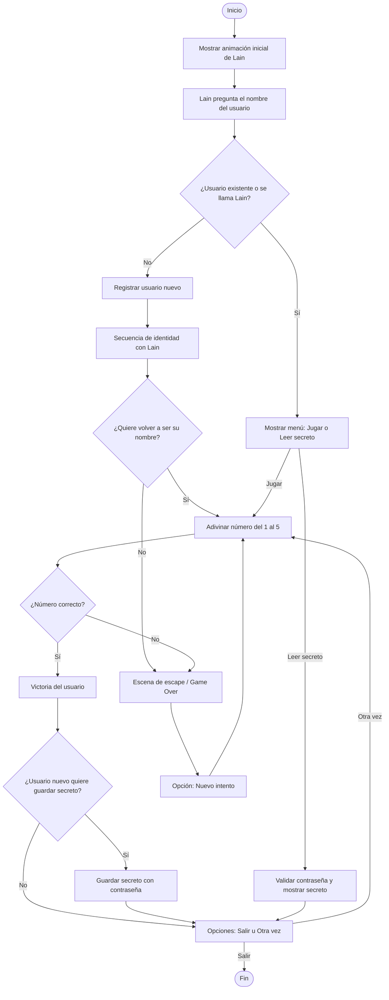

# Mini Lain

<table>
<tr>
<td width="60%" valign="top">

Mini Lain es un pequeño juego inspirado en la protagonista del anime [*Serial experiments Lain*](https://www.imdb.com/title/tt0500092/). La dinámica simula un diálogo con Lain en el que tras conocer tu nombre te reta a que adivines el número que está pensando entre 5 opciones que van del 1 al 5.

Si fallas entrará en bucle hasta que adivines el número, como si quedaras atrapado en ["The Wired"](https://lain.fandom.com/wiki/The_Wired), así hasta que adivines el número y decidas si quedarte en el bucle o salir.

</td>
<td width="40%" align="center">

</td>
</tr>
</table>

## Algoritmo simplificado
A continuación se describe de forma simplificado el flujo de la aplicación, el [algoritmo completo](./doc/algoritmo.md) es en `doc/`.

