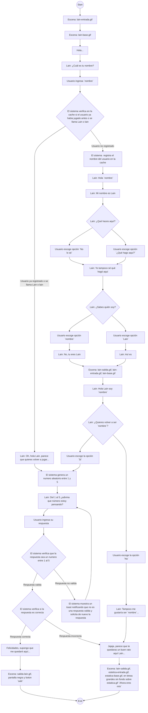

# Algoritmo

```mermaid
flowchart TD

A@{ shape: circle, label: "Start" } -->

    Entrada[Escena: lain-entrada.gif] -->

    Base[Escena: lain-base.gif] -->

    Saludo[Hola...] -->

    PreguntaNombre[Lain: ¿Cuál es tu nombre?] -->

    UsuarioNombre[Usuario ingresa `nombre`] -->

    VerificarUsuario{El sistema verifica en la cache si el usuario ya habia jugado antes o se llama Lain o lain}

    VerificarUsuario --> |Usuario ya registrado o se llama Lain o lain| UsuarioRegistrado[Lain: Oh, hola Lain, parece que quieres volver a jugar...]

    UsuarioRegistrado --> GenerarNumero

    VerificarUsuario --> |Usuario no registrado| UsuarioNoRegistrado[El sistema  registra el nombre del usuario en la cache]

    UsuarioNoRegistrado --> SaludoNombre[Lain: Hola `nombre`]

    SaludoNombre --> Presentacion[Lain: Mi nombre es Lain]

    Presentacion -->

    PreguntaMotivo{Lain: ¿Qué haces aquí?}

    PreguntaMotivo --> MotivoDesconocido[Usuario escoge opción `No lo sé`]

    PreguntaMotivo --> MotivoReflexivo[Usuario escoge opción `¿Qué hago aquí?`]

    MotivoDesconocido --> RespuestaMotivo[Lain: Yo tampoco sé qué hagó aquí]

    MotivoReflexivo --> RespuestaMotivo

    RespuestaMotivo --> PreguntaIdentidad{Lain: ¿Sabes quién soy?}

    PreguntaIdentidad --> IdentidadNombre[Usuario escoge opción `nombre`]

    PreguntaIdentidad --> IdentidadLain[Usuario escoge opción `Lain`]

    IdentidadNombre --> RespuestaIdentidadNombre[Lain: No, tu eres Lain]

    IdentidadLain --> RespuestaIdentidadLain[Lain: Así es]

    RespuestaIdentidadNombre --> Reaparicion[Escena: lain-salida.gif, lain-entrada.gif, lain-base.gif]

    RespuestaIdentidadLain --> Reaparicion

    Reaparicion --> SaludoLain[Lain: Hola Lain soy `nombre`]

    SaludoLain --> PreguntaFinal{Lain: ¿Quieres volver a ser `nombre`?}

    PreguntaFinal --> RespuestaFinalSi[Usuario escoge la opción `Si`]

    PreguntaFinal --> RespuestaFinalNo[Usuario escoge la opción `No`]

    RespuestaFinalNo --> LainBurla[Lain: Tampoco me  gustaría ser `nombre`...]

    RespuestaFinalSi --> GenerarNumero[El sistema genera un numero aleatorio entre 1 y 5]

    GenerarNumero --> PreguntaReto[Lain: Del 1 al 5 ¿adivina que número estoy pensando?]

    PreguntaReto --> RespuestaReto[Usuario ingresa su respuesta]

    RespuestaReto --> VerificacionRespuestaReto{El sistema verifica que la respuesta sea un numero entre 1 al 5}

    VerificacionRespuestaReto --> |Respuesta no valida| NotificacionRespuestaInvalida[El sistema muestra un toast notificando que no es una respuesta valida y solicita de nuevo la respuesta]

    NotificacionRespuestaInvalida --> PreguntaReto

    VerificacionRespuestaReto --> |Respuesta valida| VerificacionRespuestaCorrecta{El sistema verifica si la respuesta es correcta}

    VerificacionRespuestaCorrecta --> |Respuesta correcta| NotificacionRespuestaCorrecta[Felicidades, supongo que me quedaré aquí...]

    VerificacionRespuestaCorrecta --> |Respuesta incorrecta| NotificacionRespuestaIncorrecta[Jajaja, parece que te quedaras un buen rato aquí Lain...]

    NotificacionRespuestaCorrecta --> LainDesaparicion[Escena: salida-lain.gif, pantalla negra y boton `salir`]

    NotificacionRespuestaIncorrecta --> LainEscapa[Escena: lain-salida.gif, estetica-entrada.gif, estatica-base.gif, en letras grandes sin fondo sobre estatica.gif `Ahora eres mío`]

    LainBurla --> NotificacionRespuestaIncorrecta

    LainDesaparicion --> Z

    LainEscapa --> Z

Z@{ shape: circle, label: "End" }
```