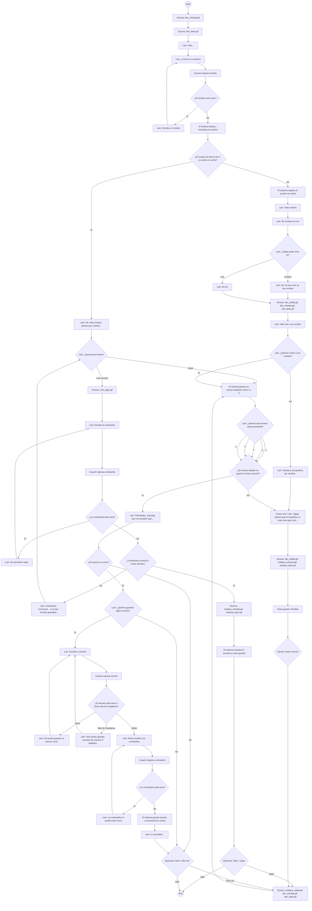

# Algoritmo

```mermaid
flowchart TD

A@{ shape: circle, label: "Start" } -->
    Entrada[Escena: lain_entrada.gif] -->
    Base[Escena: lain_base.gif] -->
    Saludo[Lain: Hola...] -->
    PreguntaNombre[Lain: ¿Cuál es tu nombre?] -->
    UsuarioNombre[Usuario ingresa nombre] -->
    ValidarNombre{¿El nombre está vacío?}

ValidarNombre -->|Sí| NombreVacio[Lain: Escribe un nombre]
NombreVacio --> PreguntaNombre

ValidarNombre -->|No| NormalizarNombre[El sistema limpia y normaliza el nombre]
NormalizarNombre --> VerificarUsuario{¿El usuario se llama Lain o ya existe en cache?}

VerificarUsuario -->|Sí| UsuarioExistente[Lain: Oh, hola nombre, parece que volviste...]
UsuarioExistente --> MenuExistente{Lain: ¿Qué quieres hacer?}

MenuExistente -->|Jugar| GenerarNumero
MenuExistente -->|Leer secreto| LoginSecreto[Escena: navi_login.gif]

LoginSecreto --> PreguntarPasswordLeer[Lain: Escribe la contraseña]
PreguntarPasswordLeer --> UsuarioPasswordLeer[Usuario ingresa contraseña]
UsuarioPasswordLeer --> ValidarPasswordLeer{¿La contraseña está vacía?}

ValidarPasswordLeer -->|Sí| PasswordLeerVacio[Lain: No escribiste nada.]
PasswordLeerVacio --> PreguntarPasswordLeer

ValidarPasswordLeer -->|No| ValidarSecreto{¿Contraseña correcta y existe secreto?}

ValidarSecreto -->|No| PasswordIncorrecto[Lain: Contraseña incorrecta... o no hay secreto guardado.]
PasswordIncorrecto --> MenuExistente

ValidarSecreto -->|Sí| EscenaSecreto[Escena: estatica_entrada.gif, estatica_base.gif]
EscenaSecreto --> MostrarSecreto[El sistema muestra el secreto en texto grande]
MostrarSecreto --> OpcionesSecreto{Opciones: Salir o Jugar}

OpcionesSecreto -->|Salir| Z
OpcionesSecreto -->|Jugar| ReintentarReto

VerificarUsuario -->|No| RegistrarUsuario[El sistema registra al usuario en cache]
RegistrarUsuario --> SaludoNombre[Lain: Hola nombre]
SaludoNombre --> Presentacion[Lain: Mi nombre es Lain]
Presentacion --> PreguntaIdentidad{Lain: ¿Sabes quién eres tú?}

PreguntaIdentidad -->|nombre| RespuestaIdentidadNombre[Lain: No, tú eres Lain yo soy nombre]
PreguntaIdentidad -->|Lain| RespuestaIdentidadLain[Lain: Así es]

RespuestaIdentidadNombre --> Reaparicion[Escena: lain_salida.gif, lain_entrada.gif, lain_base.gif]
RespuestaIdentidadLain --> Reaparicion

Reaparicion --> SaludoLain[Lain: Hola Lain, soy nombre]
SaludoLain --> PreguntaFinal{Lain: ¿Quieres volver a ser nombre?}

PreguntaFinal -->|Sí| GenerarNumero[El sistema genera un número aleatorio entre 1 y 5]
PreguntaFinal -->|No| LainBurla[Lain: Tampoco me gustaría ser nombre...]
LainBurla --> Derrota

GenerarNumero --> PreguntaReto{Lain: ¿Adivina qué número estoy pensando?}

PreguntaReto -->|1| VerificarRespuesta
PreguntaReto -->|2| VerificarRespuesta
PreguntaReto -->|3| VerificarRespuesta
PreguntaReto -->|4| VerificarRespuesta
PreguntaReto -->|5| VerificarRespuesta

VerificarRespuesta{¿El número elegido es igual al número secreto?}

VerificarRespuesta -->|No| Derrota[Suena risa / Lain: Jajaja, parece que te quedarás un buen rato aquí Lain...]

Derrota --> Escape[Escena: lain_salida.gif, estatica_entrada.gif, estatica_base.gif]
Escape --> GameOver[Texto grande: Perdiste]
GameOver --> NuevoIntento{Opción: Nuevo intento}
NuevoIntento --> ReintentarReto[Escena: estatica_salida.gif, lain_entrada.gif, lain_base.gif]
ReintentarReto --> GenerarNumero

VerificarRespuesta -->|Sí| VictoriaLinea[Lain: Felicidades, supongo que me quedaré aquí...]
VictoriaLinea --> UsuarioNuevoVictoria{¿El usuario es nuevo?}

UsuarioNuevoVictoria -->|No| OpcionesVictoria
UsuarioNuevoVictoria -->|Sí| PreguntarGuardarSecreto{Lain: ¿Quieres guardar algún secreto?}

PreguntarGuardarSecreto -->|No| OpcionesVictoria
PreguntarGuardarSecreto -->|Sí| PreguntarSecreto[Lain: Escribe tu secreto]

PreguntarSecreto --> UsuarioSecreto[Usuario ingresa secreto]
UsuarioSecreto --> ValidarSecretoNuevo{¿El secreto está vacío o tiene más de 8 palabras?}

ValidarSecretoNuevo -->|Vacío| SecretoVacio[Lain: No puedo guardar un secreto vacío.]
SecretoVacio --> PreguntarSecreto

ValidarSecretoNuevo -->|Más de 8 palabras| SecretoLargo[Lain: Solo puedo guardar secretos de máximo 8 palabras.]
SecretoLargo --> PreguntarSecreto

ValidarSecretoNuevo -->|Válido| PreguntarPasswordNuevo[Lain: Ahora escribe una contraseña]
PreguntarPasswordNuevo --> UsuarioPasswordNuevo[Usuario ingresa contraseña]
UsuarioPasswordNuevo --> ValidarPasswordNuevo{¿La contraseña está vacía?}

ValidarPasswordNuevo -->|Sí| PasswordNuevoVacio[Lain: La contraseña no puede estar vacía.]
PasswordNuevoVacio --> PreguntarPasswordNuevo

ValidarPasswordNuevo -->|No| GuardarSecreto[El sistema guarda secreto y contraseña en cache]
GuardarSecreto --> Recordar[Lain: Lo recordaré...]
Recordar --> OpcionesVictoria

OpcionesVictoria{Opciones: Salir u Otra vez}
OpcionesVictoria -->|Salir| Z@{ shape: circle, label: "End" }
OpcionesVictoria -->|Otra vez| ReintentarReto
```